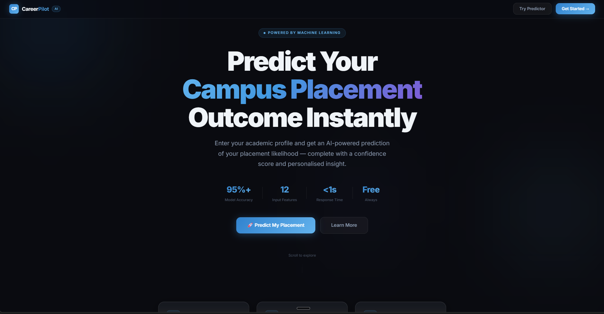
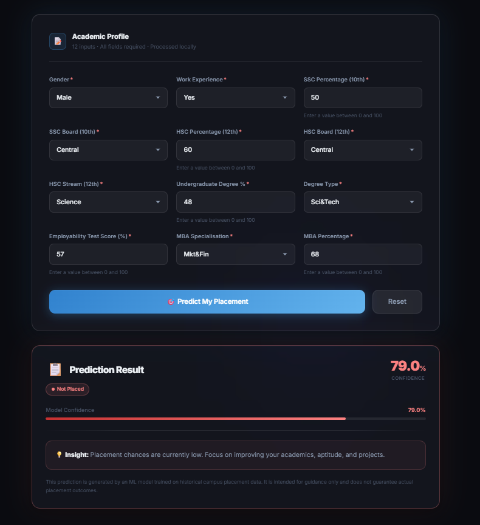
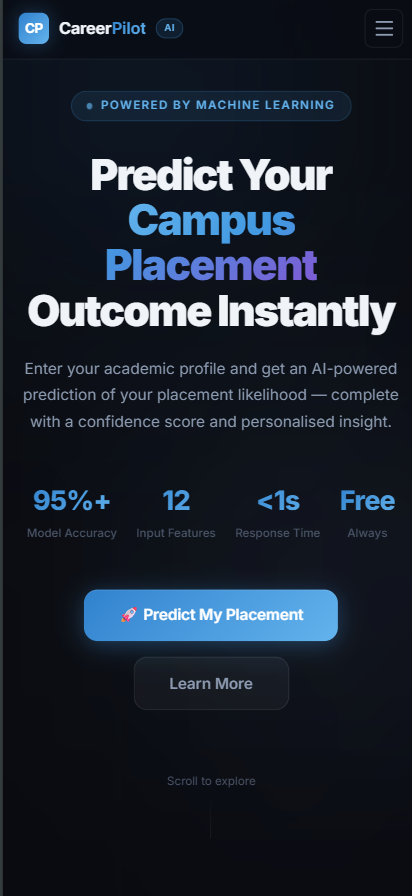

# 🚀 CareerPilot AI

> An AI-powered campus placement prediction platform that helps students estimate their placement chances using Machine Learning.

Built with **React**, **TypeScript**, **FastAPI**, and **Scikit-learn**.

---

# 📌 Overview

CareerPilot AI is an end-to-end machine learning web application that predicts whether a student is likely to be placed based on academic performance and skill-related attributes.

The application combines a trained Random Forest model with a FastAPI backend and a modern React frontend to provide real-time predictions through an intuitive user interface.

---

# ❗ Problem Statement

Students often lack a realistic understanding of how different academic and professional factors influence campus placements.

CareerPilot AI provides instant placement predictions by analyzing multiple student attributes, helping users understand their placement prospects while demonstrating the integration of machine learning into a production-style web application.

---

# ✨ Features

- 🤖 Machine Learning based placement prediction
- ⚡ FastAPI REST API backend
- 🎨 Modern React + TypeScript frontend
- 📱 Responsive design
- 📊 Confidence score visualization
- 🔄 Real-time prediction
- ✅ Input validation
- ❌ Error handling
- 🚀 Clean production-ready architecture

---

# 🛠 Tech Stack

## Frontend

- React
- TypeScript
- Tailwind CSS
- Axios
- Vite

## Backend

- FastAPI
- Python
- Pydantic
- Uvicorn

## Machine Learning

- Scikit-learn
- Pandas
- NumPy
- Joblib

---

# 🏗 Architecture

```
                React Frontend
                      │
                  Axios API
                      │
              FastAPI Backend
                      │
          Data Preprocessing
                      │
          Random Forest Model
                      │
             Placement Result
```

---

# 📂 Project Structure

```
career-compass-ai/

├── backend/
│   ├── app.py
│   ├── model/
│   └── utils/
│
├── frontend/
│   ├── src/
│   ├── components/
│   └── services/
│
├── docs/
├── screenshots/
├── assets/
├── README.md
└── LICENSE
```

---

# ⚙ Installation

## Clone Repository

```bash
git clone <your-repository-url>
cd career-compass-ai
```

## Backend

```bash
cd backend

pip install -r requirements.txt

uvicorn app:app --reload
```

## Frontend

```bash
cd frontend

npm install

npm run dev
```

---

# 🔌 API

## POST /predict

Predicts placement probability.

Example Request

```json
{
  "ssc_percentage": 85,
  "hsc_percentage": 78,
  "degree_percentage": 74,
  "work_experience": "Yes"
}
```

Example Response

```json
{
  "prediction": "Placed",
  "confidence": 96.4
}
```

---

## 📸 Screenshots

### 🏠 Home Page



---

### 📊 Prediction Result



---

### 📱 Mobile View



# 🚀 Future Improvements

- Authentication
- User Dashboard
- Prediction History
- Explainable AI (SHAP)
- Model Retraining Pipeline
- Cloud Deployment
- Analytics Dashboard

---

## Live Demo

Deployment is currently in progress.

To run locally:

Backend

uvicorn backend.app:app --reload

Frontend

npm install
npm run dev

---

# 📄 License

This project is licensed under the MIT License.